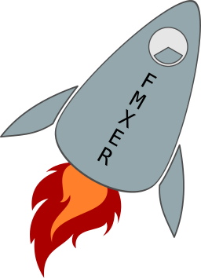

# FMXER
Visual framework (Flutter inspired) for FMX

## Delphi version:
 - Delphi 11 (Delphi 10.4 should be just fine)

## Submodules:
 - lib\TFrameStand: [TFrameStand and TFormStand](https://github.com/andrea-magni/TFrameStand)
  
## Demos
 - HelloWorld
 - DataSet
 - Column

## Video
 - [CodeRage 2019: Introducing FMXER](https://youtu.be/RiK2re19Kyk)

## Quick start
1. Clone this repository
2. If you haven't yet, install TFrameStand:
    - Open lib\TFrameStand\packages\FrameStand_11.groupproj group project
    - Build all
    - Install design time package
3. Open demos\HelloWorld\HelloWorldProject.dproj hit Run.

## Available Forms/Frames
[List of available elements](List.md)
Missing something? just open an issue or implement your own (it's easy!) and submit a pull request.

Contact me if you encounter any problem (just open an issue here) and please provide me some feedback about this project!

# Related Links
Embarcadero Delphi is a modern, powerful and effective language and development tool. Learn more about it at the following links:
 * https://www.embarcadero.com/
 * https://learndelphi.org/
